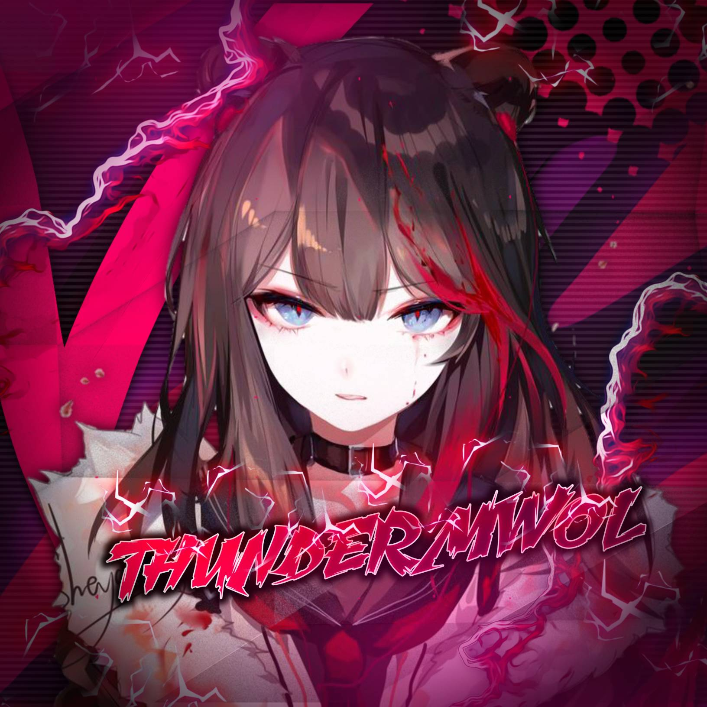

<div align="center">
  
  <p align="center">
    
    
  <p>
<a href="#"></a>            <a href="https://tinyurl.com/yf66lpbm"></a>


  
<a href="https://chat.whatsapp.com/Ima3CdRZ81NCvGshtcQhK3"></a>
</p>
</div>
<p align="center">
Project created by <a href="https://github.com/pepesir">P3P3-SIR</a> to make it public
    <br>
       | © |
        Reserved |
    <br> 
</p>

## Setup
<div align="center">

  ### Simple Method
  
[](https://heroku.com/deploy?template=https://github.com/Roshanpepe/ThunderMwol) 
  
[](https://replit.com/@pepesir/LizaMwol?v=1)
  
### The Hard Method
```js
GET QR
$ apt install git
$ apt install nodejs --fix-missing
$ git clone https://github.com/pepesir/ThunderMwol
$ cd ThunderMwol
$ npm install @adiwajshing/baileys
$ npm install chalk
$ node Liza.js
```
      
```js
SETUP
$ git clone https://github.com/pepesir/ThunderMwol
$ cd LIZA-MWOL
$ npm i
$ node Liza.js
```

----

  <p align="center">
  <a href="https://github.com/pepesir/ThunderMwol">
    
<a href="https:https://github.com/pepesir?tab=followers">

<p align="center">
<a href="https://github.com/pepesir/followers"
</a>
<a href="https://github.com/pepesir/ThunderMwol/stargazers/"></a>
<a href="https://github.com/pepesir/ThunderMwol/network/members"></a>
<a href="https://github.com/pepesir/ThunderMwol/watchers"></a>
</p>

<p align="center">
<p>&nbsp;</p>
    
  <div align="center">
       
  
  </div>
 
  
  [](https://chat.whatsapp.com/Ima3CdRZ81NCvGshtcQhK3)
                     
### ⚠ Warning ⚠

```
By using kick, add, promote, demote Commands, Your WhatsApp account may be banned.
ThunderMwol or we are not responsible for your account, 
This bot is intended for the purpose of having fun with some fun commands 
and group management with some helpfull commands.

If  you ended up spamming groups, getting reported left and right, 
and you ended up in being fight with WhatsApp
and at the end WhatsApp Team deleted your account. DON'T BLAME US.

No personal support will be provided / We won't spoon feed you. 
If you need help
you can contact 👇🏻👇🏻 
```
**[](http://wa.me/917736622139?text=Can%20you%20help%20bro)**


## Developers
  <div align="center">
    
[](https://github.com/pepesir) | [](https://github.com/Chunkindepadayali) | [](https://github.com/farhan-dqz) | [](https://github.com/TOXIC-DEVIL) |  [](https://github.com/AI-VIKI) | [](https://github.com/afnanplk) 
----|----|----|----|----|----
[PEPE SIR](https://github.com/pepesir) | [Chunkindepadayali](https://github.com/Chunkindepadayali) | [farhan-dqz](https://github.com/farhan-dqz) | [TOXIC-DEVIL](https://github.com/TOXIC-DEVIL) | [TOXIC4L!3N](https://github.com/AI-VIKI) | [afnanplk](https://github.com/afnanplk) 
Modifiying as public | Modifiying as public | Developer, Base, Bug Fixes, Modules| Re-Developer, Bug Fixes, Modules, Commits |  Modifiying  as   public | Bug Fixes, Modules 
  </div>
    


## License
This project is protected by `GNU General Public Licence v3.0` license.

### Disclaimer
`WhatsApp` name, its variations and the logo are registered trademarks of Facebook. We have nothing to do with the registered trademark
